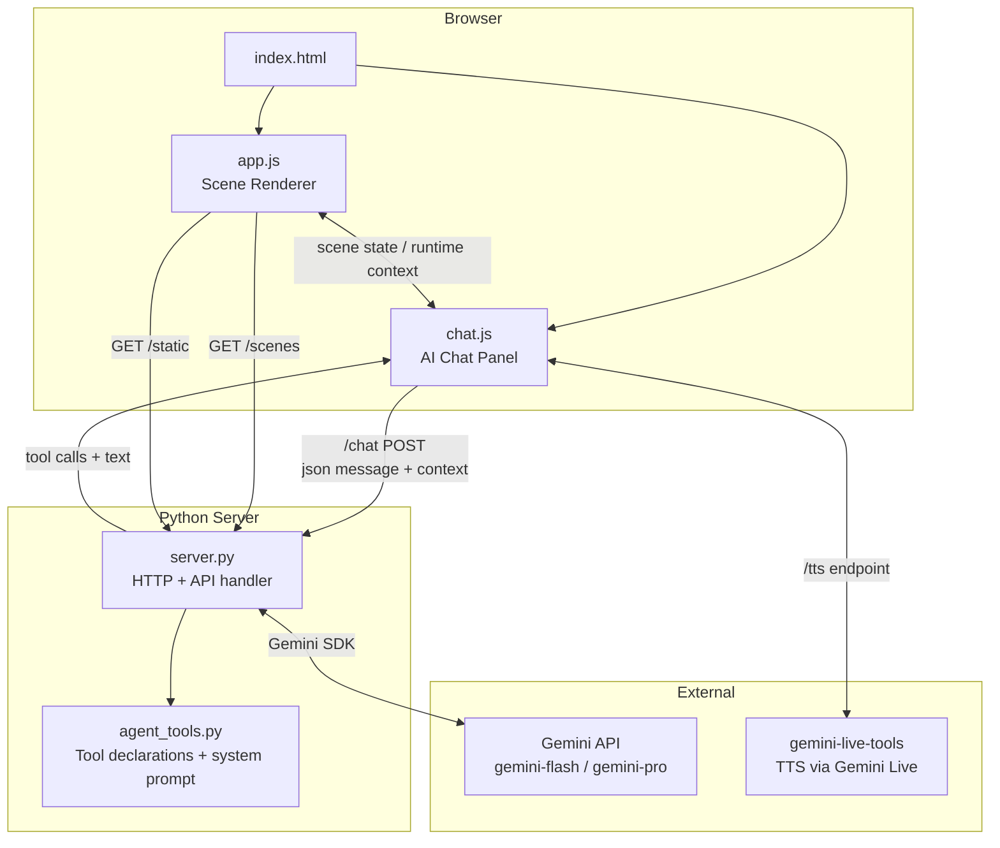

# MathBoxAI — Architecture Reference

> Technical documentation for contributors and maintainers.

**Related docs:**
- [README](../README.md) — Project overview and quick start
- [sandbox-model.md](sandbox-model.md) — Expression evaluation, trust model, security boundary
- [sandboxing-plan.md](sandboxing-plan.md) — Implementation status and backend sandboxing roadmap
- [feature-ideas.md](feature-ideas.md) — Roadmap ideas and creative directions

---

## 1. Overview

MathBoxAI is an interactive 3D math visualization tool with an embedded AI tutor. Users explore mathematical concepts through animated 3D scenes, interact with live sliders, and converse with a Gemini-powered agent that can navigate, explain, and dynamically build new scenes.

**Core design principles:**

- **Scene-as-data**: all visualizations are described in JSON — no visualization code written per-scene
- **Sandbox-first**: expressions are evaluated through math.js by default; native JS requires explicit user trust
- **Agent as first-class citizen**: the AI agent has the same scene-building API as human authors
- **Zero build step**: pure Python server + CDN-loaded frontend libraries; run directly from source

---

## 2. High-Level Architecture



---

## 3. Backend — `server.py`

A single-file Python HTTP server built on `http.server.BaseHTTPRequestHandler`. No web framework.

### Responsibilities

| Endpoint | Method | Purpose |
|---|---|---|
| `/` | GET | Serve `index.html` |
| `/static/*` | GET | Serve JS/CSS assets |
| `/scenes` | GET | List built-in scene JSON files |
| `/scenes/<file>` | GET | Serve a scene JSON file |
| `/chat` | POST | Forward message to Gemini, handle tool calls, return response |
| `/tts` | POST | Stream TTS audio via Gemini Live |

### Chat Request Lifecycle

1. Browser POSTs `{ messages, context, history }` to `/chat`
2. Server calls `build_system_prompt(context)` (from `agent_tools.py`) to inject live scene state
3. Sends to Gemini with tool declarations
4. Gemini returns text + optional tool calls
5. Server executes tool calls (scene mutations, slider updates, memory ops)
6. Returns `{ text, toolCalls, memory }` to browser

### Agent Memory

`_agent_memory: dict` — persists across turns within a server session. The AI agent stores computed arrays, matrices, and intermediate values here via `eval_math(store_as=...)` or `mem_set(...)`. Referenced as `$key` in `add_scene` fields or as variables in subsequent `eval_math` calls.

### Key Config

| Variable | Default | Description |
|---|---|---|
| `GEMINI_API_KEY` | env | Required for AI chat |
| `GEMINI_MODEL` | `gemini-3-flash-preview` | Model for chat |
| `DEFAULT_PORT` | `8785` | HTTP listen port |

---

## 4. Agent Layer — `agent_tools.py`

Defines all Gemini tool declarations and the dynamic system prompt builder.

### Tools

| Tool | Description |
|---|---|
| `navigate_to` | Change scene/step number |
| `set_camera` | Move camera to preset view or custom position |
| `add_scene` | Build and append a new 3D scene |
| `set_sliders` | Animate sliders to target values |
| `eval_math` | Evaluate Python math expressions; supports sweeps and `store_as` |
| `mem_get` | Read a value from agent memory |
| `mem_set` | Write a value to agent memory |
| `set_preset_prompts` | Set clickable suggestion chips in the chat UI |
| `set_info_overlay` | Add/update/clear floating LaTeX overlays on the canvas |

### System Prompt

`build_system_prompt(context)` assembles the prompt fresh on every user message, injecting:

- **Current State**: scene number, step, camera position, visible elements, active sliders
- **Lesson Structure**: full scene/step tree for navigation
- **Current Scene Definition**: JSON of the current scene (steps trimmed to current position — agent cannot read ahead)
- **Current Explanation**: scene markdown
- **Agent Memory**: keys and shapes of stored values
- **Scene Instructions**: per-scene `prompt` field for specialized agent behavior
- **Instructions**: general agent behavior rules
- **Agent Tools Reference**: loaded from `agent-tools-reference.md`

---

## 5. Frontend — `app.js`

The main renderer (~6000 lines). Loads scene JSON and renders it using MathBox + Three.js.

### Key Subsystems

#### Scene Loading & Navigation

```
loadScene(json)
  └── buildSceneTree()       # left-panel nav tree
  └── navigateTo(sceneIdx, stepIdx)
        └── buildScene()     # reconstruct MathBox objects
        └── buildSliders()   # create slider UI
        └── buildLegend()    # color legend
        └── buildInfoOverlays()
```

#### Element Rendering

Each element in `scene.elements` and `step.add` is dispatched by `type`:

**Static elements** — built once, zero per-frame cost:

| Type | Description |
|---|---|
| `axis` | Coordinate axis line |
| `grid` | Reference grid on xy, xz, or yz plane |
| `vector` | Static arrow from `from` to `to` |
| `vectors` | Batch of static arrows from `froms`/`tos` arrays |
| `vector_field` | Dense arrow field driven by `fx`, `fy`, `fz` expressions over a grid |
| `point` | One or more static points |
| `line` | Polyline through a list of points |
| `plane` | Finite plane defined by normal and point |
| `polygon` | Flat filled polygon from a vertex list |
| `cylinder` | Static cylinder between two endpoints |
| `sphere` | 3D sphere mesh |
| `ellipsoid` | Ellipsoid with per-axis radii (supports `centerExpr`/`radiiExpr` for slider-driven shape) |
| `surface` | Height surface `z = f(x, y)` over a 2D range |
| `parametric_curve` | Continuous curve: `x(t)`, `y(t)`, `z(t)` expressions over a range |
| `parametric_surface` | 3D surface: `x(u,v)`, `y(u,v)`, `z(u,v)` expressions |
| `text` | 3D text label at a fixed position |
| `skybox` | Background style — solid color, starfield, or gradient |

**Animated elements** — update every frame via expression evaluation:

| Type | Description |
|---|---|
| `animated_vector` | Arrow driven by `expr`/`fromExpr` (and optionally `visibleExpr`, `trail`, keyframes) |
| `animated_point` | Point driven by `expr` position expressions |
| `animated_line` | Polyline with per-vertex `points` expression arrays |
| `animated_cylinder` | Cylinder with `fromExpr`/`toExpr`/`radiusExpr` |
| `animated_polygon` | Filled polygon with per-vertex `vertices` expression arrays |

#### Expression Evaluation

See **Section 7 — Expression Sandbox** below.

#### Slider System

Sliders are defined per-step in `step.sliders`. Each slider gets:
- An HTML `<input type="range">` rendered in the slider overlay
- Its value stored in `sceneSliders[id].value`
- An animation system (`set_sliders` tool) that tweens values over ~800ms

#### Camera System

Three modes:
1. **Free camera** — OrbitControls / TrackballControls, user-driven
2. **Step camera override** — `step.camera` animates camera when navigating
3. **Follow cam** — tracks an animated element; activates via preset views with `"follow": [...]`

Follow cam computes target position from `animatedElementPos` (updated every frame) and supports angle-lock to maintain orientation relative to a direction vector.

#### Coordinate Systems

- **Data space**: the coordinate system used in scene JSON (e.g., km for orbital scenes)
- **World space**: Three.js world coordinates, scaled by `dataCameraToWorld()` / `dataToWorld()`
- MathBox handles its own internal coordinate mapping via `range`

---

## 6. Frontend — `chat.js`

Manages the AI chat panel, conversation history, TTS, and tool-call dispatch.

### Tool Call Dispatch

When the server returns tool calls, `chat.js` executes them client-side:

| Tool call received | Client action |
|---|---|
| `navigate_to` | Calls `window.navigateTo(scene, step)` |
| `set_camera` | Calls `window.setCamera(...)` |
| `add_scene` | Calls `window.addScene(sceneJson)` |
| `set_sliders` | Calls `window.setSliders(values)` |
| `set_preset_prompts` | Renders suggestion chips |
| `set_info_overlay` | Calls `window.setInfoOverlay(...)` |

### TTS Pipeline

1. AI response text passed to `/tts` endpoint
2. Server streams PCM audio via Gemini Live API
3. Browser plays via Web Audio API
4. Voice character and Gemini voice selectable in UI

### Context Snapshot

Before each `/chat` POST, `chat.js` collects a runtime context snapshot:

```js
{
  currentScene,        // full scene JSON
  sceneNumber,         // 1-based
  totalScenes,
  sceneTree,           // [{sceneNumber, title, steps}]
  lessonTitle,
  runtime: {
    stepNumber,        // 0=root
    cameraPosition,
    cameraTarget,
    cameraViews,       // named preset list
    visibleElements,   // [{type, label}]
    sliders,           // {id: {value, min, max, step, label}}
    currentCaption,
    projection,        // perspective | orthographic
    activeTab,         // doc | chat
  }
}
```

---

## 7. Expression Sandbox

> Full details: [sandbox-model.md](sandbox-model.md)

All expression strings in scene JSON are evaluated through a **two-tier model**.

### Tier 1 — math.js (default, sandboxed)

- Uses math.js own parser — no `eval`, no `new Function`
- Scope: only slider values + `t` (animation time) are injected
- No access to browser APIs (`window`, `document`, `fetch`, etc.)
- Syntax: `sin(t)`, `pi`, `x^2`, `pow(x,n)`, `atan2(y,x)`

### Tier 2 — Native JS (`new Function`, trust-gated)

Triggered when expressions match `_JS_ONLY_RE` (detects `let`, `const`, `Math.`, `=>`, method calls, etc.) or when scene declares `"unsafe": true`.

User sees a **Trust Dialog** and must explicitly choose:
- **Trust & Enable JS** — native execution, blue "Native JS" status pill
- **Run Safely** — JS expressions silently return 0, amber warning pill

### Extended Sandbox Functions

Beyond standard math.js, `app.js` injects domain-specific helpers available in all scenes:

| Function | Description |
|---|---|
| `orbitX(t, mode)` | X position of orbital trajectory at time t |
| `orbitY(t, mode)` | Y position |
| `orbitR(t, mode)` | Radius from planet center |
| `orbitVr(t, mode)` | Radial velocity |
| `orbitVt(t, mode)` | Tangential velocity |
| `orbitHit(t, mode)` | 1 if trajectory has hit the planet, else 0 |
| `orbitOutcome(t, mode)` | Human-readable orbit outcome string |
| `toFixed(val, n)` | Format number to n decimal places |

### Scene-Level Functions (`scene.functions`)

Scenes can define their own reusable expression helpers in a top-level `functions` array. These are compiled once and made available as named functions in all expressions within that scene — just like built-in helpers.

```json
"functions": [
  {
    "name": "orbitPeriX",
    "args": ["mode"],
    "expr": "orbitX(orbitPeriT(mode), mode)"
  }
]
```

This is how the orbital scene implements apogee/perigee markers — the core `orbitX/orbitR` helpers are built into `app.js`, but the higher-level `orbitPeriX`, `orbitApoX` etc. are defined as scene functions in the JSON itself. Scene functions can call other scene functions and all built-in helpers, and can use IIFE expressions for loops or complex logic (which marks the scene as `unsafe`).

---

## 8. Orbital Simulation Engine

The orbital scenes use a custom numerical integrator built directly in `app.js`.

### Three Modes

| Mode index | Name | Description |
|---|---|---|
| `0` | `coast` | Purely ballistic — initial conditions, no thrust |
| `1` | `powered` | Constant thrust for `tburn` seconds, then coast |
| `2` | `guided` | Two-burn: gravity-turn ascent + coast + prograde circularization |

### Integration

- **Method**: Symplectic Euler (energy-conserving for orbital mechanics)
- **Step count**: 800–6000 steps depending on `T`
- **Arrays stored**: `arrT`, `arrX`, `arrY`, `arrVx`, `arrVy`, `arrR`, `arrVr`, `arrVt`, `arrHit`
- **Cache**: keyed by all relevant slider values; rebuilt only when sliders change

### Cache Lookup

`_getOrbitalState(mode, tSec)` — linear interpolates between adjacent integration steps for smooth animation at any `t`.

### Guided Mode Burn Logic

- **Burn 1**: thrust along pitch angle that transitions from `pitch_start` to `pitch_end` over `t_pitch` seconds
- **Coast**: pure gravity, no thrust
- **Burn 2**: feedback guidance — trims tangential speed toward $v_\text{circ,target}$ and damps radial velocity

---

## 9. Scene JSON Format

Scenes are standalone JSON files loaded at startup or dropped into the browser.

### Top-Level Structure

```json
{
  "title": "Scene Title",
  "unsafe": false,
  "unsafe_explanation": "...",
  "scenes": [ { scene }, { scene }, ... ]
}
```

### Scene Object

```json
{
  "title": "...",
  "description": "...",
  "markdown": "LaTeX-enabled explanation...",
  "prompt": "Agent instructions for this scene",
  "range": [[-15000,15000],[-15000,15000],[-15000,15000]],
  "camera": { "position": [x,y,z], "target": [x,y,z] },
  "cameraUp": [0,0,1],
  "views": [ { "name": "Iso", "position": [...], "target": [...] } ],
  "elements": [ { element }, ... ],
  "steps": [ { step }, ... ]
}
```

### Step Object

```json
{
  "title": "Step title",
  "description": "Caption shown below viewport",
  "camera": { "position": [...], "target": [...] },
  "sliders": [ { slider }, ... ],
  "add": [ { element }, ... ],
  "info": [ { overlay }, ... ]
}
```

### Slider Object

```json
{
  "id": "h",
  "label": "Altitude h (km)",
  "min": 0, "max": 2000, "step": 10, "default": 420,
  "animate": true,
  "animateMode": "loop",
  "duration": 5000
}
```

### Info Overlay Object

```json
{
  "id": "my_panel",
  "position": "top-left",
  "content": "$$r(t) = {{toFixed(orbitR(t,0), 1)}}\\,\\text{km}$$"
}
```

`{{expr}}` placeholders are evaluated live using math.js on every render frame.

---

## 10. Dependencies

### Python (backend)

| Package | Version | Purpose |
|---|---|---|
| `google-genai` | ≥1.27.0 | Gemini API SDK |
| `numpy` | ≥1.26.0 | Math eval (vector/matrix ops for agent) |
| `gemini-live-tools` | GitHub | TTS streaming via Gemini Live |

### JavaScript (CDN, frontend)

| Library | Version | Purpose |
|---|---|---|
| Three.js | 0.137.0 | 3D rendering foundation |
| MathBox | 2.3.1 | Mathematical coordinate systems + rendering |
| KaTeX | 0.16.9 | LaTeX math rendering |
| math.js | 13.0.0 | Sandboxed expression evaluation (Apache 2.0) |
| marked | 12.0.0 | Markdown rendering for explanation panel |
| OrbitControls | (Three.js) | Camera interaction |

---

## 11. Built-in Scenes

| File | Topic |
|---|---|
| `vector-operations.json` | Vector addition, dot/cross product, projection |
| `matrix-transformations.json` | 2D/3D linear transforms, eigenspaces |
| `eigenvalues.json` | Eigenvalue/eigenvector geometry |
| `fourier-series.json` | Fourier approximation, partial sums |
| `parametric-curves.json` | Parametric curves in 2D/3D |
| `gradient-descent-terrain.json` | Gradient descent on a 3D surface (unsafe JS) |
| `orbital-flight-simulation.json` | Orbital mechanics, powered flight, insertion |
| `rotating-habitat.json` | Rotating space habitat, artificial gravity |

---

## 12. Data Flow Summary

```
User types message
        │
        ▼
chat.js collects runtime context snapshot
        │
        ▼
POST /chat  {messages, context, history}
        │
        ▼
server.py builds system prompt (scene state injected)
        │
        ▼
Gemini API  →  text response + tool calls
        │
        ▼
server.py executes server-side tools (eval_math, mem_set, etc.)
        │
        ▼
Response {text, toolCalls} returned to browser
        │
        ▼
chat.js dispatches tool calls to app.js
  ├── add_scene    → app.js builds new MathBox scene
  ├── navigate_to  → app.js rebuilds scene at target step
  ├── set_sliders  → app.js tweens slider values
  └── set_camera   → app.js animates camera
        │
        ▼
app.js render loop  (requestAnimationFrame)
  ├── evaluate expressions (math.js sandbox or new Function)
  ├── update animated element positions
  ├── update info overlay placeholders
  └── update follow cam
```

---

*Generated from source review — March 2026.*
